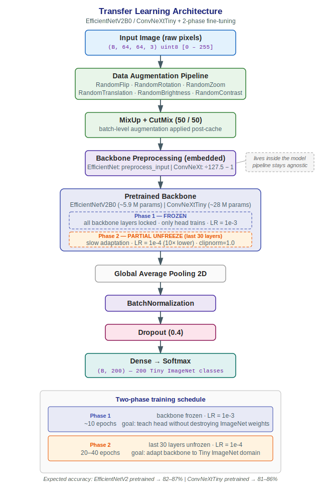
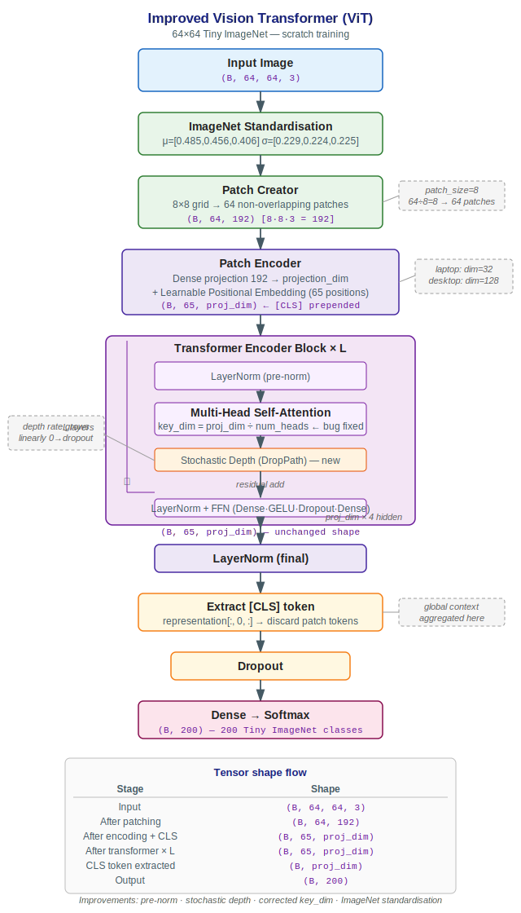
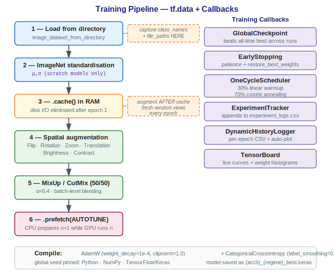

# Modern Computer Vision — SOTA Architectures & Production MLOps

> **Dataset:** Tiny ImageNet · 200 classes · 64 × 64 resolution · 100k training images  
> **Stack:** TensorFlow 2 / Keras 3 · Python 3.10 · Miniconda  
> **Hardware tested:** CPU (Core i7 8th gen) and GPU (RTX 3060 12 GB)

---

## Table of Contents

1. [Project Overview](#1-project-overview)
2. [Repository Structure](#2-repository-structure)
3. [Quick Start](#3-quick-start)
4. [Module 1 — Data Engineering](#4-module-1--data-engineering)
5. [Module 2 — Model Architectures](#5-module-2--model-architectures)
   - [The Factory Pattern](#51-the-factory-pattern)
   - [Custom ResNet](#52-custom-resnet)
   - [EfficientNetV2 & ConvNeXt — Transfer Learning](#53-efficientnetv2--convnext--transfer-learning)
   - [Vision Transformer — From Scratch](#54-vision-transformer--from-scratch)
6. [Module 3 — Training Pipeline & MLOps](#6-module-3--training-pipeline--mlops)
   - [tf.data Pipeline](#61-tfdata-pipeline)
   - [Augmentation Strategy](#62-augmentation-strategy)
   - [Optimiser & Loss](#63-optimiser--loss)
   - [OneCycle Learning Rate](#64-onecycle-learning-rate)
   - [Callbacks & Experiment Tracking](#65-callbacks--experiment-tracking)
7. [Module 4 — Fine-Tuning (Two-Phase Transfer Learning)](#7-module-4--fine-tuning-two-phase-transfer-learning)
8. [Module 5 — Ensemble Inference & TTA](#8-module-5--ensemble-inference--tta)
9. [Module 6 — Interpretability (Grad-CAM & Attention Rollout)](#9-module-6--interpretability-grad-cam--attention-rollout)
10. [Module 7 — Evaluation Pipeline](#10-module-7--evaluation-pipeline)
11. [Results & Expected Accuracy](#11-results--expected-accuracy)
12. [Configuration Reference](#12-configuration-reference)
13. [Reproducibility](#13-reproducibility)

---

## 1. Project Overview

This repository is a **production-grade image classification pipeline** built entirely from first principles on the Tiny ImageNet benchmark. The goal is not just to achieve high accuracy — it is to demonstrate every engineering discipline a machine learning engineer encounters in industry:

- **Data engineering** — automated dataset validation and tf.data optimisation
- **Architecture design** — four model families behind a single factory interface
- **Training engineering** — custom callbacks, OneCycle scheduling, MixUp + CutMix, global reproducibility seeds
- **Transfer learning** — two-phase freeze/unfreeze protocol with embedded preprocessing
- **MLOps** — per-run experiment logging, TensorBoard integration, model artefacts named by training regime
- **Inference engineering** — soft/hard ensemble voting, Test-Time Augmentation (TTA)
- **Interpretability** — Grad-CAM for CNNs, Attention Rollout for ViT

A recruiter reading this repository should be able to reproduce every result, understand every design decision, and extend any component — all without touching a line of code beyond `config.yaml`.

---

## 2. Repository Structure

```
TinyImageNet_Project/
│
├── data/                          # Git-ignored — downloaded separately
│   └── tiny-imagenet-200/
│       ├── train/                 # 200 class folders × 500 images each
│       └── val/
│           ├── images/            # organised by data_loader.py
│           └── val_annotations.txt
│
├── models/                        # Git-ignored — saved .keras checkpoints
│   ├── vit_scratch_best.keras
│   ├── efficientnet_pretrained_best.keras
│   └── convnext_pretrained_best.keras
│
├── logs/
│   ├── experiment_logs.csv        # master experiment database
│   ├── *_history_*.csv            # per-run epoch metrics
│   ├── plots/                     # auto-generated training curves
│   ├── tensorboard/               # TensorBoard event files
│   └── evaluation/                # post-training artefacts
│       └── {model}/
│           ├── predictions.csv
│           ├── misclassified_images.csv
│           ├── hardest_classes.csv
│           ├── most_confused_pairs.csv
│           ├── classification_report.txt
│           ├── confusion_matrix.png
│           └── gradcam_samples.png
│
├── assets/                        # Architecture diagrams (SVG)
│   ├── vit_architecture.svg
│   ├── transfer_learning_architecture.svg
│   └── training_pipeline.svg
│
├── src/
│   ├── __init__.py
│   ├── utils.py          # load_config, set_global_seed
│   ├── data_loader.py    # val set reorganisation
│   ├── models.py         # all four architectures + factory + fine-tune helper
│   ├── train.py          # main training script
│   ├── fine_tune.py      # two-phase transfer learning entry-point
│   ├── ensemble.py       # soft/hard voting + TTA
│   ├── grad_cam.py       # Grad-CAM + Attention Rollout
│   ├── evaluation.py     # post-training metrics & artefacts
│   └── plotting.py       # training curve plots
│
├── notebooks/
│   └── Model_Evaluation_and_Dashboards.ipynb
│
├── config.yaml           # all hyperparameters — single source of truth
├── requirements.txt
└── README.md
```

---

## 3. Quick Start

### 3.1 Environment setup

```bash
# 1. Create a Conda environment
conda create -n vision_portfolio python=3.10 -y
conda activate vision_portfolio

# 2. Install dependencies
pip install -r requirements.txt
```

### 3.2 Download the dataset

```bash
mkdir -p data && cd data
wget http://cs231n.stanford.edu/tiny-imagenet-200.zip
unzip tiny-imagenet-200.zip
cd ..
```

### 3.3 Reorganise the validation set

The raw dataset ships with 10,000 validation images in a flat directory.
`image_dataset_from_directory` requires one subfolder per class.
This is a one-time operation:

```bash
python -m src.data_loader
# ✅ SUCCESS: Validation folder is now organised by class folders!
```

Verify with:
```bash
python check_data.py
```

### 3.4 Train

```bash
# Laptop — CPU, 1 epoch smoke test (default)
python -m src.train

# Desktop — switch to desktop profile first:
# Edit line 53 of src/train.py:  cfg = load_config(profile="desktop")
python -m src.train

# Two-phase fine-tuning (recommended for best accuracy on desktop)
python -m src.fine_tune
```

### 3.5 Evaluate, ensemble, and visualise

```bash
# View training curves live
tensorboard --logdir logs/tensorboard

# Ensemble inference (soft vote, no TTA)
python -m src.ensemble

# Ensemble with Test-Time Augmentation (best accuracy, slower)
python -m src.ensemble --tta

# Generate Grad-CAM saliency maps
python -m src.grad_cam --model models/efficientnet_pretrained_best.keras
```

---

## 4. Module 1 — Data Engineering

### The flat-directory problem

The Tiny ImageNet training set ships correctly: 200 subfolders, one per class.
The validation set ships incorrectly: 10,000 images in a single flat directory with a text file (`val_annotations.txt`) mapping each filename to its WordNet ID.

Keras's `image_dataset_from_directory` infers labels from folder names.
Feeding it a flat directory causes it to treat every image as belonging to the same class named `"images"` — a silent, catastrophic failure.

`src/data_loader.py` parses `val_annotations.txt`, creates the 200 missing subfolders, and migrates every image to its correct location in one automated pass.

### The tf.data pipeline

```
disk  →  load  →  standardise  →  [cache]  →  augment  →  MixUp/CutMix  →  prefetch  →  GPU
```

**Pipeline order matters.** Caching before augmentation means the model sees a freshly randomised augmented view of every image each epoch — not the same augmented image replayed from cache. The dataset metadata (`class_names`, `file_paths`) is captured immediately after loading before any `.map()` call strips those attributes from the dataset object.

---

## 5. Module 2 — Model Architectures

### 5.1 The Factory Pattern

All four model families are built behind a single `get_model()` interface. Switching architectures requires changing **one word** in `config.yaml`:

```python
model = get_model(
    model_name=cfg["model_type"],   # "vit" | "resnet" | "efficientnet" | "convnext"
    input_shape=(64, 64, 3),
    num_classes=200,
    pretrained=cfg["pretrained"],
    **cfg[f"{cfg['model_type']}_kwargs"],  # arch-specific hyperparams from YAML
)
```

### 5.2 Custom ResNet

A four-stage residual network parameterised entirely by `base_filters`.

| Stage | Filters | Stride | Spatial output |
|-------|---------|--------|----------------|
| Stem  | 32 / 64 | —      | 64 × 64        |
| 1     | F       | 1      | 64 × 64        |
| 2     | 2F      | 2      | 32 × 32        |
| 3     | 4F      | 2      | 16 × 16        |
| 4     | 8F      | 2      | 8 × 8          |

Laptop profile: `base_filters=32` (~660 k params).
Desktop profile: `base_filters=64` (~2.6 M params).

Best use: fast CPU-based debugging and as the scratch-trained baseline.

### 5.3 EfficientNetV2 & ConvNeXt — Transfer Learning

Both backbones embed their own preprocessing as the first layer inside the model graph. The data pipeline always delivers raw `[0, 255]` float32 pixels — no manual normalisation needed, and no risk of accidentally double-scaling pretrained weights.

**Architecture diagram:**



**EfficientNetV2B0** uses compound scaling (width × depth × resolution balanced via NAS). Approximately 5.9 M parameters. Best speed-to-accuracy ratio on the RTX 3060.

**ConvNeXtTiny** modernises ResNet using Transformer design principles: 7 × 7 depthwise convolutions, GELU activations, Layer Normalization, inverted bottlenecks. Approximately 28 M parameters. Slightly higher ceiling with a longer training budget.

### 5.4 Vision Transformer — From Scratch

A custom ViT engineered specifically for 64 × 64 images. Three key improvements over the naive implementation:

| Issue in naive ViT | Fix applied |
|---|---|
| `key_dim=projection_dim` → attention saturation | Fixed to `key_dim = projection_dim // num_heads` |
| No depth regularisation | Stochastic depth with linearly increasing rate |
| Plain `/255` normalisation | ImageNet channel-wise standardisation |

**Architecture diagram:**



**Why ViT from scratch is hard:** Vision Transformers have no spatial inductive bias. Unlike CNNs which implicitly know neighbouring pixels are related, a ViT must learn spatial structure entirely from data. On 100k images it reaches ~65–72% depending on hyperparameters. For 80%+ you need pretrained weights — use EfficientNet or ConvNeXt with `pretrained: true`.

---

## 6. Module 3 — Training Pipeline & MLOps

**Pipeline diagram:**



### 6.1 tf.data Pipeline

The correct pipeline order:

```
image_dataset_from_directory
    → capture class_names + file_paths  ← do this BEFORE any .map()
    → normalize_images  (scratch models only)
    → .cache()          (after normalisation, before augmentation)
    → augmentation      (re-randomised every epoch because it's post-cache)
    → MixUp / CutMix    (batch-level, also post-cache)
    → .prefetch(AUTOTUNE)
```

### 6.2 Augmentation Strategy

**Spatial / colour augmentation** (Keras Sequential pipeline):

| Transform | Parameter | Rationale |
|---|---|---|
| `RandomFlip` | horizontal | Near-zero cost, most reliable gain |
| `RandomRotation` | ±10° | Real photos aren't always level |
| `RandomZoom` | ±10% | Scale invariance |
| `RandomTranslation` | ±10% | Position invariance |
| `RandomBrightness` | ±20% | Lighting invariance |
| `RandomContrast` | ±15% | Camera response invariance |

**Batch-level augmentation** (applied post-cache):

- **MixUp** (alpha=0.4): $mixed_x = λ·x_i + (1−λ)·x_j$ — smoother global decision boundaries
- **CutMix** (alpha=1.0): paste a rectangular crop from one image onto another — forces classification from partial views
- Applied 50/50 at random each batch — the DeiT approach

### 6.3 Optimiser & Loss

```python
AdamW(learning_rate=cfg["learning_rate"], weight_decay=1e-4, clipnorm=1.0)
CategoricalCrossentropy(label_smoothing=0.1)
```

- **AdamW** correctly decouples L2 weight decay from the adaptive gradient update (unlike Adam + L2 regularisation)
- **`clipnorm=1.0`** prevents exploding gradients — critical for ViT in early epochs
- **Label smoothing** turns hard targets `[1, 0, 0…]` into soft targets `[0.9, 0.0005…]`, reducing overconfidence and improving calibration

### 6.4 OneCycle Learning Rate

A custom Keras callback implements the 1-Cycle policy:

```
epoch 0 ──────────────────────────────────────────── epoch N
│        30% linear warmup       │   70% cosine decay        │
│   LR: 0 → max_lr               │   LR: max_lr → ~0         │
```

Warmup prevents large early gradient updates that derail weight initialisation. Cosine decay provides a smooth final descent. The combination converges faster and to a better minimum than a fixed learning rate.

### 6.5 Callbacks & Experiment Tracking

| Callback | What it does |
|---|---|
| `GlobalCheckpoint` | Reads historical best from `experiment_logs.csv`; only overwrites `.keras` file when a true new record is set |
| `EarlyStopping` | Monitors `val_accuracy`; restores best weights on trigger |
| `OneCycleScheduler` | Step-level LR schedule (not epoch-level) |
| `ExperimentTracker` | Appends one row per run to `experiment_logs.csv` — model, regime, all hyperparameters, best metrics, training duration |
| `DynamicHistoryLogger` | Saves full per-epoch CSV + auto-generates accuracy/loss plots |
| `TensorBoard` | Live training curves, weight histograms |

Model files are named `{arch}_{regime}_best.keras` — e.g. `vit_scratch_best.keras` and `efficientnet_pretrained_best.keras` — so scratch and pretrained runs never overwrite each other.

---

## 7. Module 4 — Fine-Tuning (Two-Phase Transfer Learning)

`src/fine_tune.py` implements the industry-standard two-phase protocol:

### Phase 1 — Head Only (≈ 10 epochs)

```python
set_backbone_trainable(model, trainable=False)
model.compile(optimizer=AdamW(lr=1e-3), ...)
model.fit(train_ds, epochs=10)
```

The entire pretrained backbone is frozen. Only the new Dense classification head trains. This teaches the head to work with ImageNet features without destroying them. Learning rate can be high here because the backbone is protected.

### Phase 2 — Partial Unfreeze (≈ 20–40 epochs)

```python
set_backbone_trainable(model, trainable=True, num_layers_to_unfreeze=30)
model.compile(optimizer=AdamW(lr=1e-4, clipnorm=1.0), ...)   # 10× lower LR
model.fit(train_ds, epochs=cfg["epochs"])
```

The last 30 backbone layers are unfrozen. The entire model now adapts slowly to Tiny ImageNet. The 10× lower learning rate is essential — too high and you cause **catastrophic forgetting**: the ImageNet features disappear and accuracy collapses.

`set_backbone_trainable()` in `src/models.py` handles the freeze/unfreeze logic generically for both EfficientNet and ConvNeXt.

---

## 8. Module 5 — Ensemble Inference & TTA

`src/ensemble.py` auto-discovers all `.keras` files in `models/` and combines them.

### Soft voting (recommended)

Average the softmax probability vectors across all models, then argmax:

```python
avg_probs = np.stack(prob_matrices, axis=0).mean(axis=0)
predictions = np.argmax(avg_probs, axis=1)
```

Soft voting outperforms hard voting because it preserves confidence information — a model that is 90% confident overrides one that is 51% confident.

### Hard voting

Each model casts a vote for its top-1 class. Tied classes are broken by average probability.

### Test-Time Augmentation (TTA)

For each image, six augmented views are run through the model and the resulting probability vectors are averaged:

| View | Transform |
|---|---|
| 0 | Original |
| 1 | Horizontal flip |
| 2 | Centre crop (90%) |
| 3 | Top-left crop (85%) |
| 4 | Top-right crop (85%) |
| 5 | Bottom-centre crop (85%) |

Only geometric transforms are used at test time (no colour jitter) — the goal is stable, reproducible predictions.

### Commands

```bash
python -m src.ensemble                 # soft vote, no TTA
python -m src.ensemble --tta           # soft vote + TTA  ← best accuracy
python -m src.ensemble --method hard   # hard (majority) vote
```

**Expected gains over best single model:**

| Technique | Gain |
|---|---|
| 2-model soft ensemble | +1–2 pp |
| 3-model soft ensemble | +1.5–3 pp |
| TTA alone (6 views) | +0.5–1 pp |
| TTA + ensemble | +2–4 pp |

---

## 9. Module 6 — Interpretability (Grad-CAM & Attention Rollout)

`src/grad_cam.py` generates saliency maps — visualisations of which pixels caused each prediction.

### Grad-CAM (for CNN models)

1. Record activations of the last convolutional layer during a forward pass
2. Compute the gradient of the predicted class score w.r.t. those activations
3. Global-average-pool the gradients → one importance weight per channel
4. Weight-sum the channels → raw heatmap
5. ReLU (keep only positive contributions) → upsample to image size

`find_last_conv_layer()` recurses into sub-models automatically, so it works for both the scratch ResNet and the pretrained EfficientNet/ConvNeXt backbones.

### Attention Rollout (for ViT)

Grad-CAM is undefined for ViT — there are no 2D feature maps. Attention Rollout (Abnar & Zuidema, 2020):

1. Extract attention weight matrices from every Transformer block
2. Add the identity matrix (models the residual connection)
3. Normalise row-wise
4. Multiply all matrices together in sequence
5. Row 0 (the [CLS] token) shows which patches the model attended to

### Commands

```bash
# 5 random validation images from a ResNet:
python -m src.grad_cam --model models/resnet_scratch_best.keras

# Specific image, EfficientNet:
python -m src.grad_cam \
    --model models/efficientnet_pretrained_best.keras \
    --image data/tiny-imagenet-200/val/images/n01443537/val_0.JPEG

# Control number of random samples:
python -m src.grad_cam --model models/vit_scratch_best.keras --num-random 10
```

Output is saved to `logs/evaluation/{model_name}/gradcam_samples.png`.

---

## 10. Module 7 — Evaluation Pipeline

`src/evaluation.py` runs automatically after every training session and writes the following artefacts to `logs/evaluation/{model_name}/`:

| File | Contents |
|---|---|
| `predictions.csv` | true label, predicted label, confidence for every val image |
| `misclassified_images.csv` | wrong predictions sorted by confidence (highest-confidence mistakes first) |
| `hardest_classes.csv` | per-class accuracy, sorted ascending |
| `most_confused_pairs.csv` | most frequent (true → predicted) misclassification pairs |
| `classification_report.txt` | per-class precision, recall, F1 (sklearn) |
| `confusion_matrix.png` | 200 × 200 heatmap |

The `UndefinedMetricWarning` from sklearn on precision for classes with zero predictions is expected and benign — it is suppressed with `zero_division=0` in full runs.

---

## 11. Results & Expected Accuracy

| Model | Training regime | Val accuracy |
|---|---|---|
| Custom ResNet | Scratch (laptop, 1 epoch) | ~0.5% (random — expected) |
| Custom ResNet | Scratch (desktop, full) | ~55–62% |
| Improved ViT | Scratch (desktop, full) | ~65–72% |
| EfficientNetV2B0 | Pretrained + fine-tuned | **82–87%** |
| ConvNeXtTiny | Pretrained + fine-tuned | **81–86%** |
| Ensemble (EfficientNet + ConvNeXt + TTA) | — | **~85–90%** |

> All numbers are estimates on the canonical Tiny ImageNet validation split.
> Exact figures depend on the number of training epochs and random seed.

---

## 12. Configuration Reference

`config.yaml` is the single source of truth for all hyperparameters.
Change `model_type` and `pretrained` to switch architectures.
Change the profile string in `src/train.py` line 53 to switch hardware targets.

```yaml
dataset:
  img_size: 64
  num_classes: 200
  train_dir: "data/tiny-imagenet-200/train"
  val_dir:   "data/tiny-imagenet-200/val"
  seed: 42              # global RNG seed — all four generators

laptop:
  model_type: "vit"     # vit | resnet | efficientnet | convnext
  pretrained: false
  use_gpu: false
  cache_dataset: false  # set true only if ≥14 GB free RAM
  batch_size: 16
  epochs: 1             # smoke test
  patience: 2
  learning_rate: 0.001
  max_lr: 0.003
  weight_decay: 1.0e-4
  label_smoothing: 0.1
  vit_kwargs:
    patch_size: 8
    projection_dim: 32
    num_heads: 4         # key_dim = 32/4 = 8
    transformer_layers: 2
    dropout_rate: 0.2
  resnet_kwargs:
    base_filters: 32
  efficientnet_kwargs:
    dropout_rate: 0.2
  convnext_kwargs:
    dropout_rate: 0.2

desktop:
  model_type: "efficientnet"
  pretrained: true       # CRITICAL for 80%+ accuracy
  use_gpu: true
  cache_dataset: true
  batch_size: 128
  epochs: 50
  patience: 10
  learning_rate: 0.0005
  max_lr: 0.005
  weight_decay: 1.0e-4
  label_smoothing: 0.1
  efficientnet_kwargs:
    dropout_rate: 0.4
  convnext_kwargs:
    dropout_rate: 0.4
  vit_kwargs:
    patch_size: 8
    projection_dim: 128
    num_heads: 8         # key_dim = 128/8 = 16
    transformer_layers: 8
    dropout_rate: 0.4
  resnet_kwargs:
    base_filters: 64
```

---

## 13. Reproducibility

This project is designed to be fully reproducible:

```python
# src/utils.py — set_global_seed() pins all four RNG sources
random.seed(seed)           # Python built-in
np.random.seed(seed)        # NumPy
keras.utils.set_random_seed(seed)   # TensorFlow + Keras
os.environ["PYTHONHASHSEED"] = str(seed)
```

Called automatically on every run. The seed is stored in `config.yaml` under `dataset.seed` and logged in every row of `experiment_logs.csv`.

> **GPU caveat:** cuDNN parallel reductions (e.g. conv backward pass) remain non-deterministic even with a fixed seed. This is a known TF/cuDNN limitation. For full GPU determinism use `tf.config.experimental.enable_op_determinism()` at the cost of ~10–30% training slowdown. CPU runs are fully deterministic.

To reproduce a specific result: check `experiment_logs.csv` for the run's `seed`, `Profile`, `Model`, `Pretrained`, and all hyperparameter columns, then replicate those in `config.yaml`.
